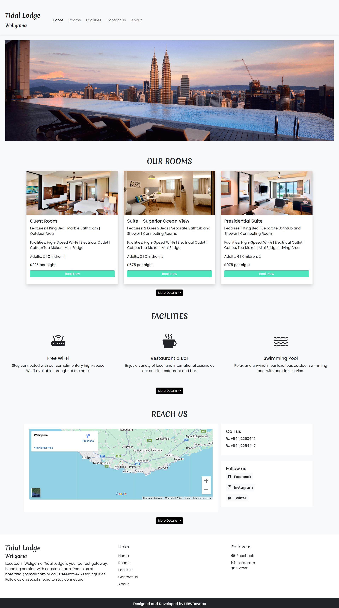
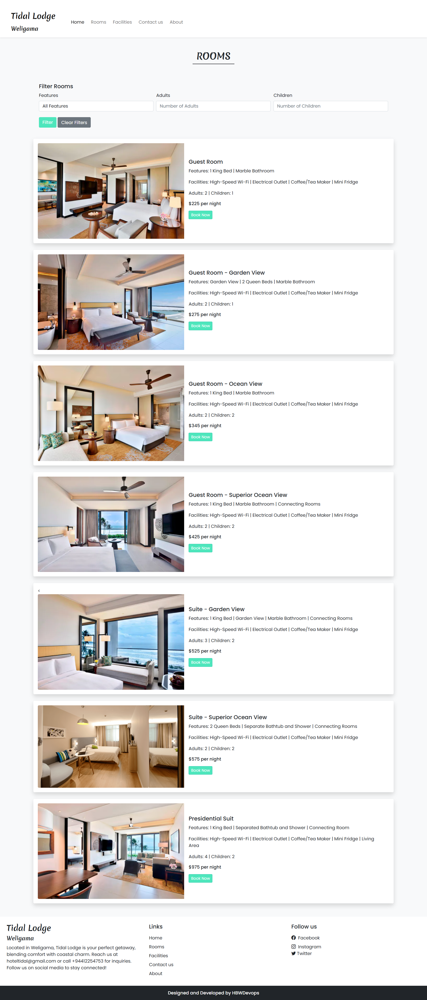
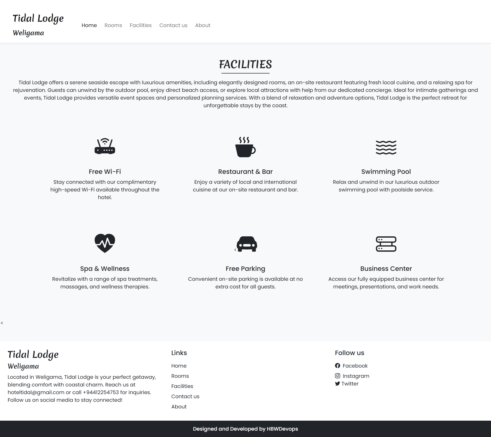
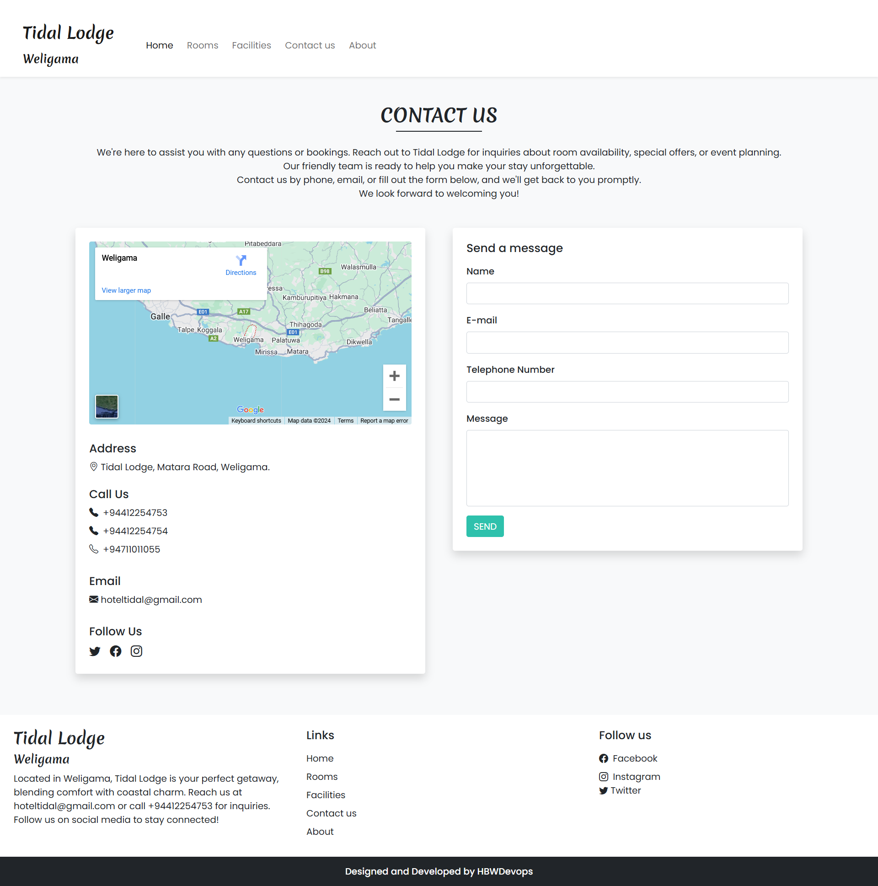
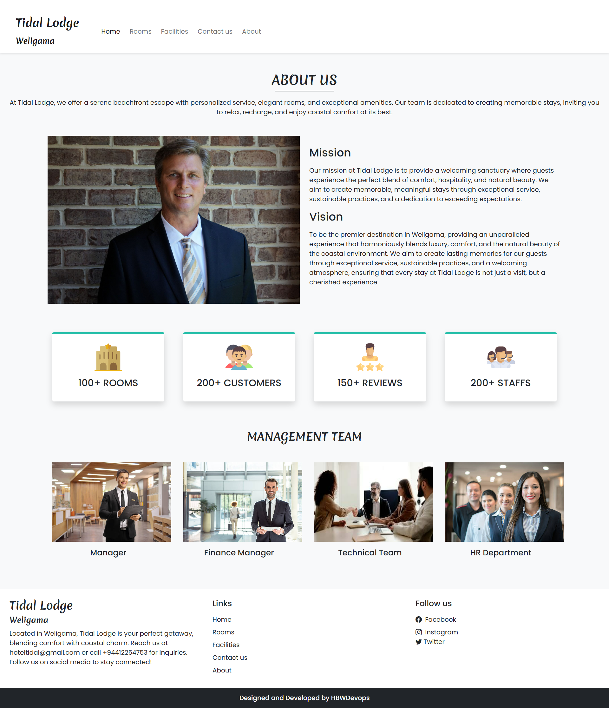
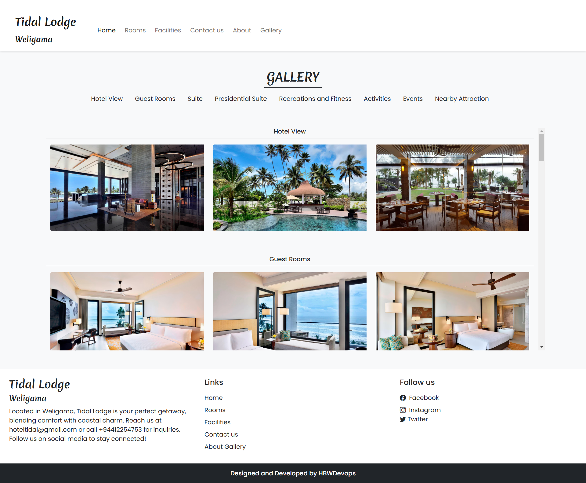
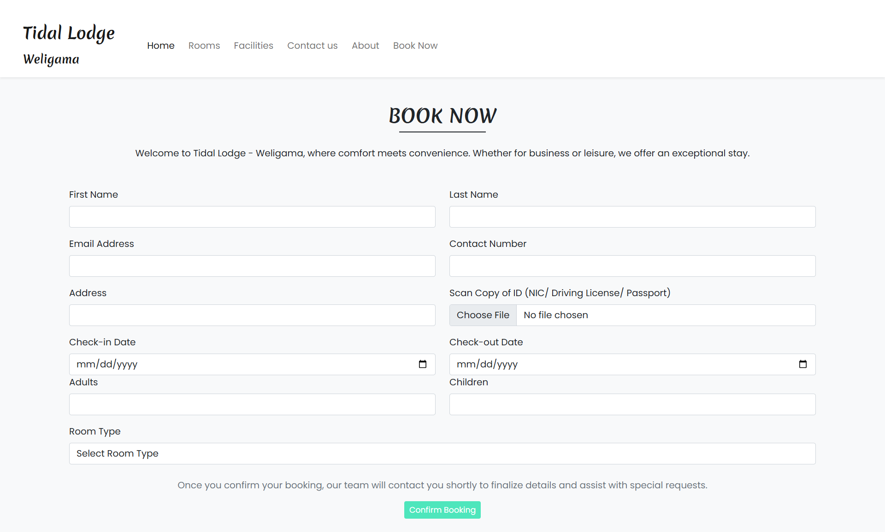

# Hotel Booking Website

This project is a fully responsive hotel booking website built using HTML, CSS, JavaScript, PHP, and MySQL. The website provides an interactive and user-friendly interface, enabling visitors to explore room options, view hotel facilities, browse a gallery of images, and book rooms.


## Table of Content

- [Project Overview](#project-overview)
- [Features](#features)
- [Pages](#pages)
- [Technologies](#technologies)
- [Setup Instruction](#setup-instruction)
- [Preview](#preview)

## Project Overview

This website is designed to enhance user experience in the hotel booking process. Visitors can explore available rooms, review hotel facilities, browse a gallery of images, and contact hotel staff for further inquiries. The website is suitable for small and medium-sized hotels looking to provide a convenient online booking solution for their guests.

## Features

**Responsive Design:** The website is mobile-friendly, adapting to various screen sizes.

**Room Filtering:** Users can filter rooms based on features and the number of guests.

**Booking Form:** Allows users to book rooms by filling out a simple form.

**Contact Form:** Provides a form for users to send messages or inquiries.

**Gallery:** Displays images of the hotel, rooms, and nearby attractions.

**Secure Connections:** Ensures secure data handling (with PHP and MySQL) and validation for user input.


## Pages

**Home Page:** A welcoming page that provides an overview of the website's layout and navigation to other sections.

**Rooms Page:** Allows users to view detailed information and photographs of each room type. Users can filter rooms based on specific features and the number of guests, making it easier to find suitable accommodations.

**Facilities Page:** Showcases the amenities available at the hotel, including dining options, recreational facilities, and other services.

**Contact Us Page:** Contains the hotel’s location, address, contact information, and a contact form for users to send messages or inquiries to the hotel staff.

**About Page:** Provides a comprehensive overview of the hotel, its mission, and introduces key members of the hotel’s staff.

**Gallery Page:** A visual collection of photographs capturing the hotel’s rooms, surrounding areas, nearby attractions, and event spaces to give users a glimpse of the hotel’s ambiance.

**Booking Page:** Allows users to book a room by filling out a form with their personal and booking details.


## Technologies


**HTML:** Creates the structure and content of web pages.

**CSS:** Style and layout of the webpage.

**JS:** Add interactive features and improved the user interface.

**PHP:** Server-side scripting for handling dynamic material on web pages.

**MySQL:** Allows to manage databases and store data.

**Bootstrap:** Create responsive design framework.


## Setup Instruction

**Prerequisites**

Make sure you have the following prerequisites installed on your machine:

-Installed XAMPP server on your machine.

-A code editor such as Visual Studio Code.

**1.Clone the Repository:**

```bash
  git clone https://github.com/Teshani-Karunarathne/Hotel-Booking-Website.git

```
**2.Set Up Database:**

Create a MySQL database

**3.Configure Database Connection:**

In contact.php and booking.php, update the database credentials (username, password, etc.) to match your MySQL setup.

**4.Run the Website**

Open the project in a XAMPP local server environment.

## Preview

### Home Page


### Rooms Page


### Facilities Page


### Contact Us Page


### About Page


### Gallery Page


### Booking Form



    
